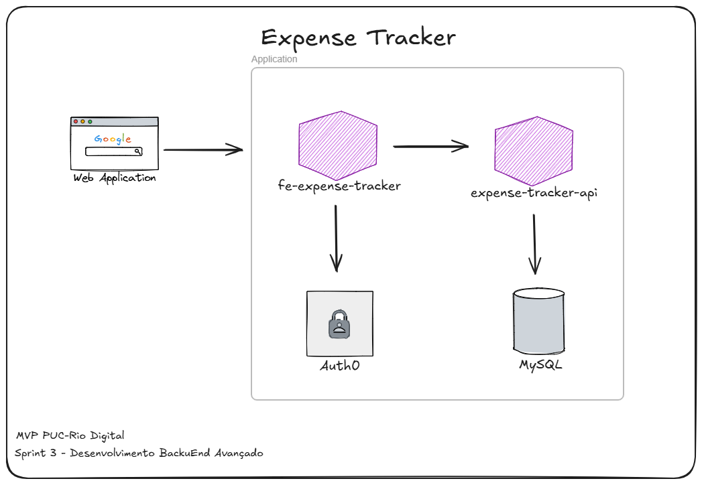

# Expense Tracker API

Projeto MVP desenvolvido durante a Sprint 3 do curso de Pós-Graduação em Desenvolvimento Full Stack da PUC-Rio Digital. O objetivo principal é explorar a implementação de um sistema composto por Front-End, Back-End e consumo de API Externa.

## Sobre o Projeto

A aplicação tem como finalidade fornecer uma interface intuitiva para que usuários possam realizar o gerenciamento de suas finanças pessoais, permitindo:
- Cadastro e controle de despesas
- Registro de receitas
- Categorização de transações
- Acompanhamento financeiro

## Arquitetura da Solução

O back-end foi desenvolvido utilizando FastAPI e SQLModel para integração com banco de dados MySQL, garantindo alta performance e tipo seguro de dados.



## Estrutura do Projeto
```
expense-tracker-app
├── app
│   ├── __init__.py
│   ├── main.py
│   ├── database
│   │   ├── __init__.py
│   │   └── engine.py
│   ├── models
│   │   ├── __init__.py
│   │   ├── categories.py
│   │   ├── expenses.py
│   │   └── incomes.py
│   └── routers
│       ├── __init__.py
│       ├── categories.py
│       ├── expenses.py
│       └── incomes.py
├── requirements.txt
└── README.md
```

## Tecnologias Utilizadas

- FastAPI: Framework moderno para construção de APIs
- Pydantic: Validação de dados
- SQLModel: ORM para interação com banco de dados
- MySQL: Sistema de gerenciamento de banco de dados

## Instalação e Execução

### Requisitos
- Python 3.8+
- pip (gerenciador de pacotes Python)
- MySQL

### Instalação das Dependências

```bash
python -m venv venv
source venv/bin/activate  # Linux/MacOS
.\venv\Scripts\activate   # Windows
pip install -r requirements.txt
```

### Executando a Aplicação

Método 1: Usando uvicorn diretamente

**Importante**: Antes de iniciar a aplicação, certifique-se de que:
1. O servidor MySQL esteja em execução
2. As credenciais configuradas em `app/database/engine.py` estejam corretas
3. O banco de dados especificado em `DATABASE_URL` exista

```bash
uvicorn app.main:app --reload
```

Para verificar se o banco de dados está acessível, você pode:
1. Acessar a rota `/health` da API
2. Verificar os logs do servidor na inicialização
3. Tentar conectar diretamente ao MySQL usando:
```bash
mysql -h localhost -u user_exp -p etracker_db
```

Método 2: Usando Docker (Recomendado para Produção)
```bash
docker-compose up --build
```

## Documentação da API

A documentação completa da API está disponível em:
- Swagger UI: `http://localhost:8000/docs`
- ReDoc: `http://localhost:8000/redoc`

## Próximos Passos

- [ ] Implementar autenticação de usuários
- [ ] Adicionar testes automatizados
- [ ] Melhorar a documentação da API
- [ ] Tornar o sistema multiusuário


## Contribuição

Para contribuir com o projeto:
1. Faça um fork do repositório
2. Crie uma branch para sua feature (`git checkout -b feature/AmazingFeature`)
3. Commit suas mudanças (`git commit -m 'Add some AmazingFeature'`)
4. Push para a branch (`git push origin feature/AmazingFeature`)
5. Abra um Pull Request

## Licença

Este projeto está sob a licença MIT. Veja o arquivo `LICENSE` para mais detalhes.


