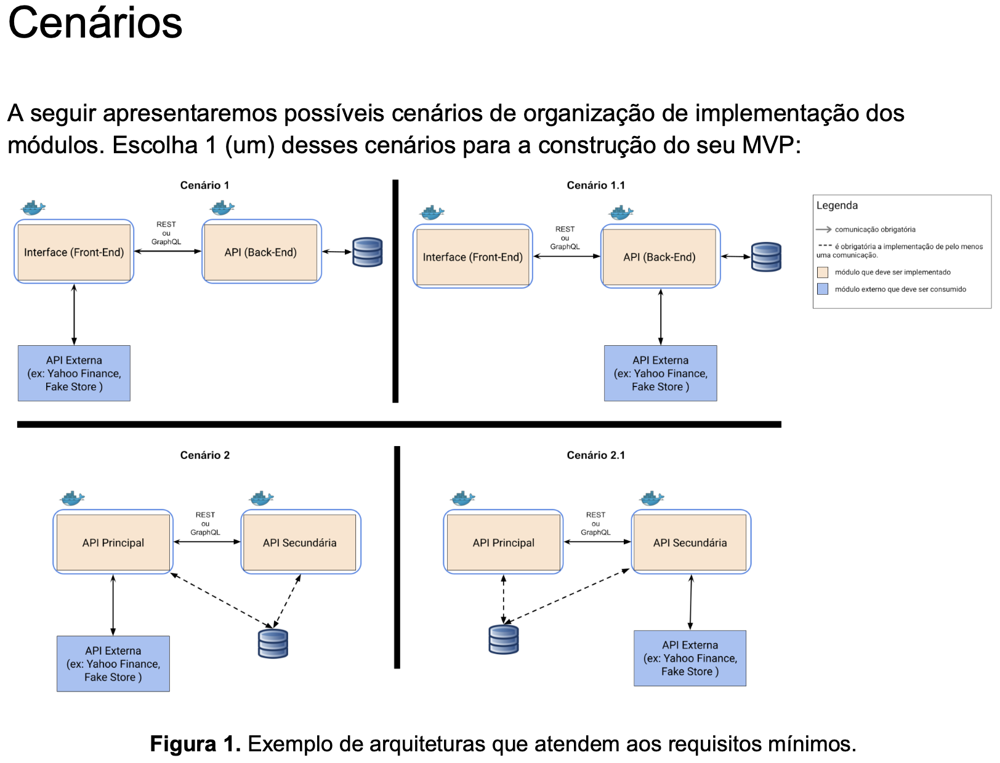

# Expense Tracker API

Projeto MVP desenvolvido durante a terceira Sprint do curso de Pós-Graduação em Desenvolvimento Full Stack da PUC-Rio Digital, com o objetivo de explorar a implentação de Sistema composto por Front-End, BackEnd 


### Instalação

```
(env)$ pip install -r requirements.txt
```

### Como executar

```
(env)$ fastapi run --host 0.0.0.0 --port 5000
```

### Tecnologias
FastAPI
Pydantic
SQLModel
Mysql


### Como executar através do Docker


### TODO
Incluir  as funcionalidades principais
tecnologias utilizadas no desenvolvimento
explicar brevemente a estrutura de pastas e responsabilidades
Incluir informações sobre objetivo do projeto 
Desenho de arquitetura 
Dockercompose




